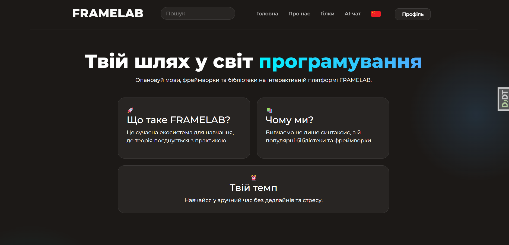
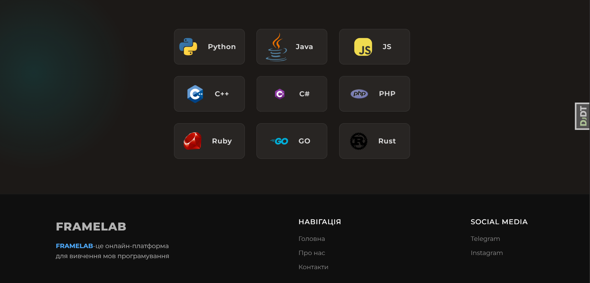
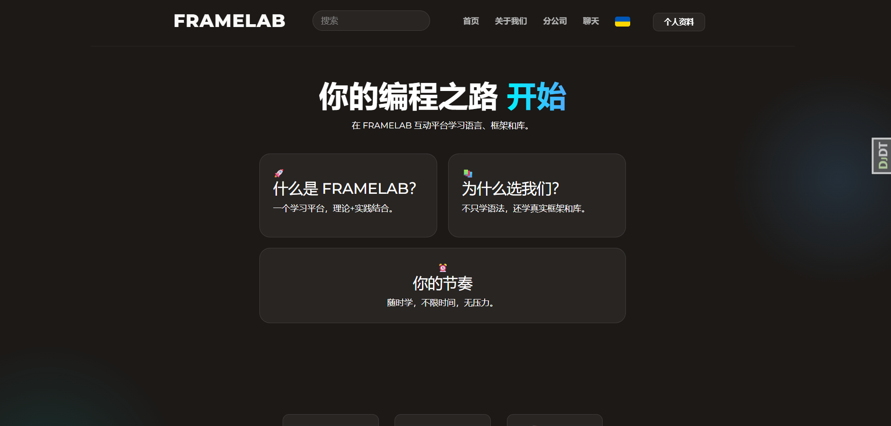
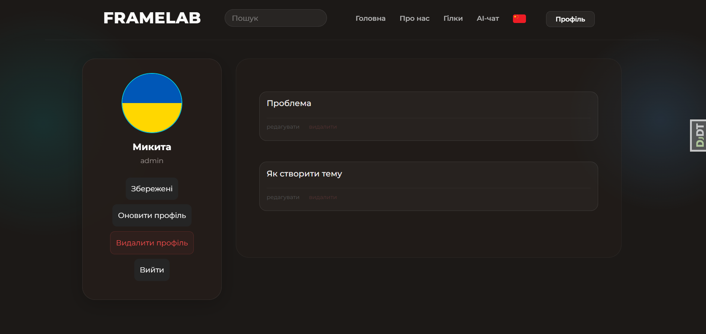
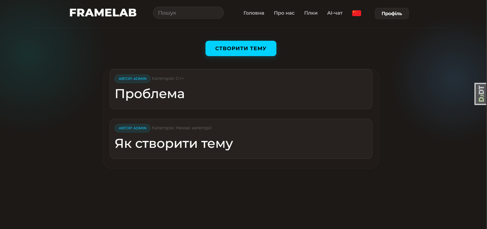
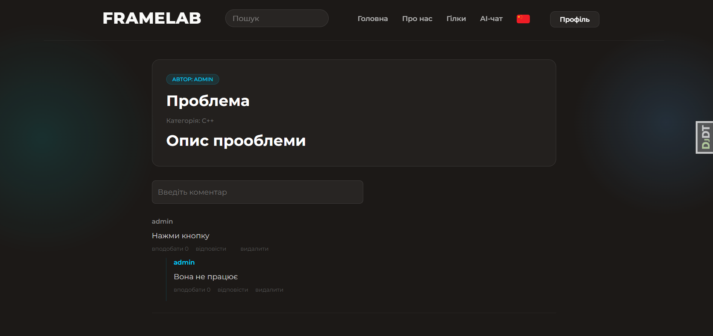
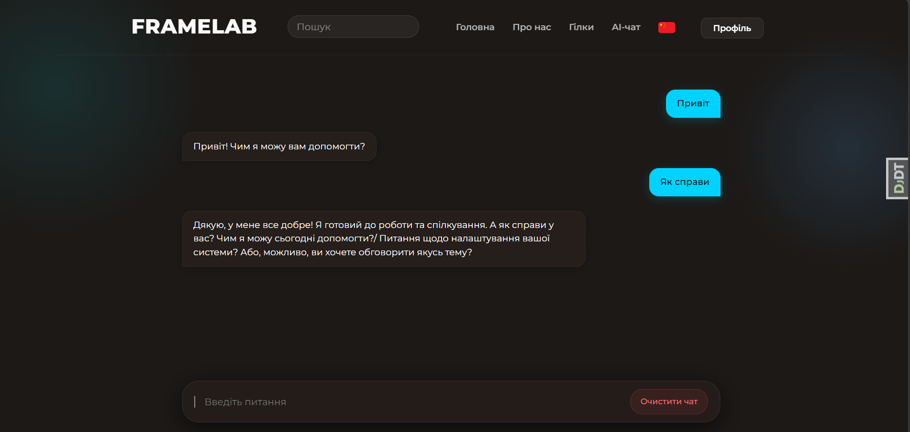

# FRAMELAB website
FRAMELAB is a platform for programmers who are looking for new knowledge and learning resources.
Our goal was to develop a web platform that helps beginner programmers learn new technologies and improve their programming skills.
______

# 🛠️ Technology stack
* Python
* Django
* PostgreSQL
* HTMX
* JavaScript
* HTML/CSS
______

# 🧩 ️Functionality 
* 🔐 User registration and authentication
* 📧 Email verification
* 🛡️ Brute-force protection with django-axes
* 🔍 Browse programming technologies
* 🔖 Save favorite technologies
* 📝 Create and manage topics
* 💬 Comment and reply system
* ❤️ Like system
* 🤖 AI-powered chat assistant
* 🇨🇳 Chinese version website
______
# 🚀 Installation
1.Create a virtual environment:
```bash
python -m venv venv
source venv/bin/activate  # Linux/Mac
venv\Scripts\activate    # Windows
```
2. Install Dependencies
```bush
pip install django

pip install psycopg2

pip install pillow

pip install django-debug-toolbar

pip install django-axes

```
3.Аpply Migrations
```bash
python manage.py migrate
```
4.Create a Superuser
```bash
python manage.py createsuperuser
```
5.Run the server
```bash
python manage.py runserver
```
______
# 🖼️ Screenshots
Main page first part:

Main page second part:

Chinese version:

User profile:

List of user topics:

Example comment system:

AI chat support:
